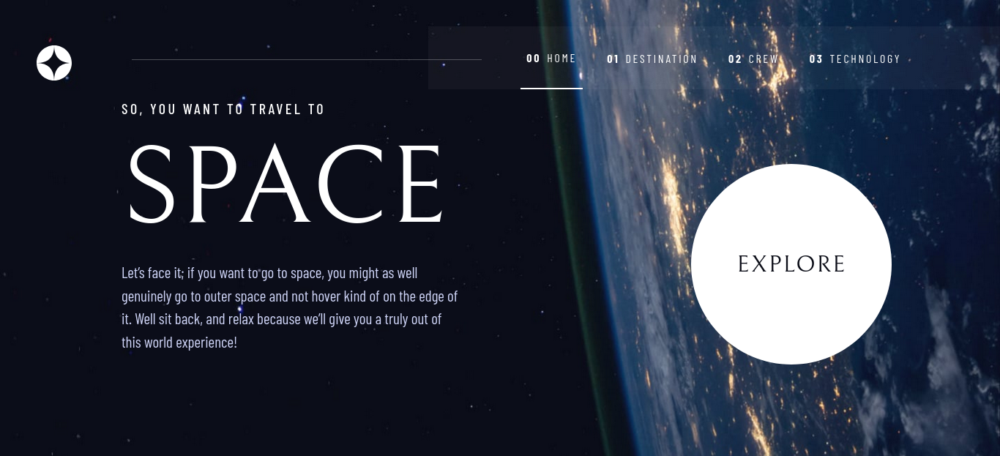

# Frontend Mentor - Space tourism website solution

This is a solution to the [Space tourism website challenge on Frontend Mentor](https://www.frontendmentor.io/challenges/space-tourism-multipage-website-gRWj1URZ3). Frontend Mentor challenges help you improve your coding skills by building realistic projects. 

## Table of contents

- [Frontend Mentor - Space tourism website solution](#frontend-mentor---space-tourism-website-solution)
  - [Table of contents](#table-of-contents)
  - [Overview](#overview)
    - [The challenge](#the-challenge)
    - [Screenshot](#screenshot)
    - [Links](#links)
  - [My process](#my-process)
    - [Built with](#built-with)
  - [Author](#author)

## Overview

### The challenge

Users should be able to:

- View the optimal layout for each of the website's pages depending on their device's screen size
- See hover states for all interactive elements on the page
- View each page and be able to toggle between the tabs to see new information

### Screenshot

### Links

- Solution URL: [Solution](https://gitlab.com/bit-01/space-tourism-multi-page-website)
- Live Site URL: [Live Site](https://bit-01.gitlab.io/space-tourism-multi-page-website)

## My process

### Built with

- Semantic HTML5 markup
- CSS custom properties
- Flexbox
- [Vue 3](https://vuejs.org/) - JS Framework
- [Vue-Router](https://router.vuejs.org/) - JS Framework for routing
- Mobile-first workflow

## Author

- Website - [Bassel Aflak](https://bit01.rf.gd)
- Frontend Mentor - [@bit-01](https://www.frontendmentor.io/profile/bibt-01)
- Gitlab - [@bit-01](https://gitlab.com/bit-01)
- Instagram - [@bit_01](https://instagram.com/bit_01)
- Codepen - [@bit-01](https://codepen.io/bit-01)
